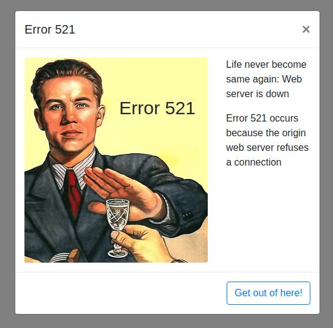

### HTTP521 pages

#### Example explanation
Here in the directory only one file (`Base521.html`)
it goes as example (I am not sure about it best example but at least it works great).
* Based on Bootstrap css
* Contain image in HTML as base64 string
* Minimal design
* W3C valid
* It not minified
* Contain one inline css `style` property just for positioning of the text.

#### Screenshot

So example based on almost default Bootstrap Modal template with image and text with explanation.
You can turn your own style or use existed. The best practice is the best, so you can use very minimal style and SVG it will drastically decrease page size and speed of loading page.
