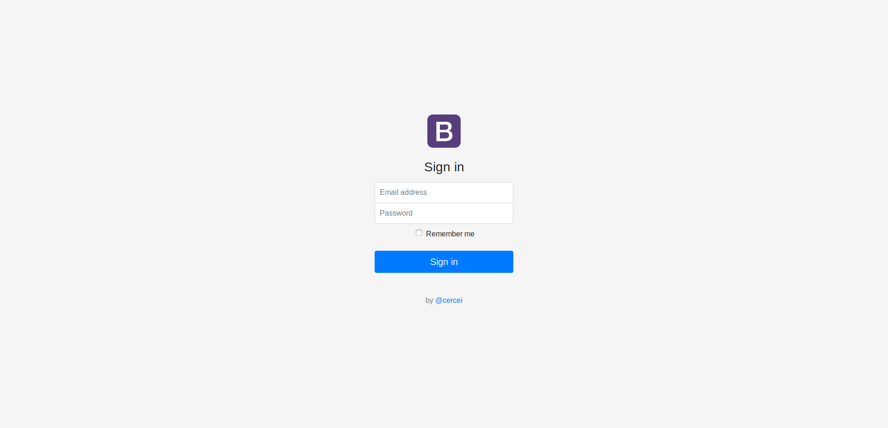

# Cercei/login-v1

## Overview
First and simplest login page based on Bootstrap css

## Toolkit
In base goes regular HTML, CSS, JS
Folder assets contain basic Bootsrap css and js files plus one customized `/css/login-v1.css`
## Goal
1. To create login page boilerplate and create tutorial for easy spin up any project.
2. Learn or refresh how to create login pages.
3. Find best solution for style and optimization, also templates without frameworks as React, Vue and Angular (Frameworks - it just better approach in some cases).
4. Find more friends and teammates on github.
5. Earn as mutch as possible stars and forks.

## Screenshot

* Last readme update 09.10.2018
